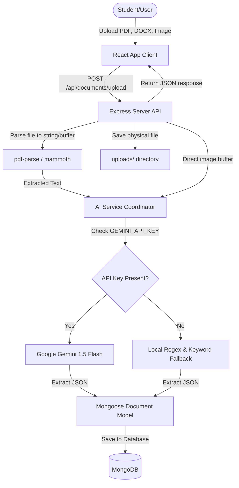

# MemoryVerse AI – Smart Student Portfolio

MemoryVerse AI is an AI-powered Digital Identity System built for the **MemoryVerse AI '26 Hackathon**. It transforms scattered academic and professional documents (such as certificates, resumes, project reports, and internship letters) into an organized, searchable, and intelligent student portfolio.

---

## 🚀 Key Features

1. **Intelligent Ingestion**: Supports uploading PDFs, DOCX, and images (JPEG, PNG, WEBP).
2. **Automated AI Analysis**: Parses text and leverages Google Gemini AI (`gemini-1.5-flash`) to generate:
   - Concisely structured **summaries** (2-3 sentences).
   - **Category classification** (Certificate, Internship, Project, Resume, Achievement, Academic).
   - Core **skill extraction** (e.g. Python, React, Machine Learning).
   - Calendar/Academic **year inference** for timeline sorting.
3. **Smart Natural Retrieval**: Smart natural language search that allows querying by categories, names, or extracted skills (e.g., searching for "Python" returns certifications, code projects, and internship documents containing Python).
4. **Digital Journey Timeline**: A chronological vertical timeline displaying the student's development milestones.
5. **Interactive Skill Tag Cloud**: Aggregated tag cloud showing skills based on credentials.
6. **Graceful Offline Fallback**: Fully functional rule-based parsing engine that simulates extraction if no `GEMINI_API_KEY` is present.

---

## 🛠️ Technology Stack

| Layer | Technology | Purpose |
| :--- | :--- | :--- |
| **Frontend** | React.js (Vite) | Responsive, state-driven user interface |
| **Styling** | Tailwind CSS | Sleek custom cards, glassmorphic effects, gradients |
| **Backend** | Node.js + Express.js | API controllers, static file service, multer file handler |
| **Database** | MongoDB + Mongoose | Schema definitions for document portfolio metadata |
| **AI Integration** | Google Gemini API | Text parsing and visual analysis of certificates and resumes |
| **File Parsing** | `pdf-parse` & `mammoth` | Local buffer extraction of raw text from PDFs and DOCX files |

---

## 🗺️ System Architecture



---

## 📦 Installation & Setup

Follow these steps to run both backend and frontend applications locally.

### Prerequisites
- [Node.js](https://nodejs.org/) (v16+)
- [MongoDB](https://www.mongodb.com/) (running locally, or MongoDB Atlas connection)

---

### Step 1: Backend Server Setup

1. Open a terminal and navigate to the `server/` directory:
   ```bash
   cd server
   ```
2. Install the backend dependencies:
   ```bash
   npm install
   ```
3. Create a `.env` file in the `server/` directory:
   ```env
   PORT=5000
   MONGODB_URI=mongodb://127.0.0.1:27017/memoryverse
   GEMINI_API_KEY=YOUR_GEMINI_API_KEY_HERE
   NODE_ENV=development
   ```
4. Start the development server (runs on `http://localhost:5000`):
   ```bash
   npm run dev
   ```

---

### Step 2: Frontend Client Setup

1. Open a new terminal and navigate to the `client/` directory:
   ```bash
   cd client
   ```
2. Install the frontend dependencies:
   ```bash
   npm install
   ```
3. Start the Vite React client (runs on `http://localhost:5173`):
   ```bash
   npm run dev
   ```
4. Open your browser and navigate to `http://localhost:5173` to explore MemoryVerse AI!

---

## 📑 API Documentation

All API endpoints are mounted on `/api/documents`.

### 1. Upload & Analyze Document
- **Endpoint**: `POST /api/documents/upload`
- **Content-Type**: `multipart/form-data`
- **Request Body**:
  - `file`: The document binary (supports `.pdf`, `.docx`, `.png`, `.jpg`, `.webp` up to 10MB).
- **Success Response (201 Created)**:
  ```json
  {
    "success": true,
    "message": "Document uploaded and analyzed successfully.",
    "data": {
      "_id": "603d2b2f...",
      "fileName": "python_certificate.pdf",
      "filePath": "uploads/1722000000000-python_certificate.pdf",
      "mimeType": "application/pdf",
      "category": "Certificate",
      "summary": "Completed Advanced Python course covering Object Oriented Programming and Data Structures.",
      "skills": ["Python", "Git", "OOP"],
      "academicYear": 2025,
      "uploadDate": "2026-07-26T17:11:00.000Z"
    }
  }
  ```

### 2. Retrieve All / Search Documents
- **Endpoint**: `GET /api/documents`
- **Query Parameters**:
  - `search` (optional): Search keyword (e.g., `?search=React`). Filter matching results on filename, category, summary, or skills list.
- **Success Response (200 OK)**:
  ```json
  {
    "success": true,
    "count": 1,
    "data": [...]
  }
  ```

### 3. Fetch Dashboard Analytics
- **Endpoint**: `GET /api/documents/stats`
- **Description**: Returns count aggregate, category distribution, top skills list, and recent 5 uploads.
- **Success Response (200 OK)**:
  ```json
  {
    "success": true,
    "data": {
      "totalDocuments": 12,
      "categoryBreakdown": {
        "Certificate": 4,
        "Internship": 2,
        "Project": 3,
        "Resume": 1,
        "Achievement": 1,
        "Academic": 1,
        "Other": 0
      },
      "topSkills": [
        { "name": "Python", "count": 5 },
        { "name": "React", "count": 4 }
      ],
      "recentFiles": [...]
    }
  }
  ```

### 4. Delete Document
- **Endpoint**: `DELETE /api/documents/:id`
- **Description**: Removes the document from MongoDB and unlinks the local file from storage.
- **Success Response (200 OK)**:
  ```json
  {
    "success": true,
    "message": "Document deleted successfully."
  }
  ```

---

## 🎨 Sample Interface Showcase

### 1. Welcome Landing Page (`Home.jsx`)
Features a dark theme navigation menu, custom radial gradients, and animated hover feature cards that highlight the core capabilities of the smart repository.

### 2. Analytics Dashboard (`Dashboard.jsx`)
A clean dashboard that displays overall stats (certificates, resumes, internships), a visual tag cloud of extracted skills, and an activity table linking to recent documents.

### 3. Ingestion Portal (`Upload.jsx`)
Features a custom dashed dropzone that accepts files and streams real-time upload status. Upon success, it displays a detailed AI extraction report (showing the category, summary, and skills extracted by Gemini).

### 4. Digital Journey Timeline (`Timeline.jsx`)
A vertical grid timeline that places milestones (e.g. 2024 Certificate, 2025 Internship) in sequence with connection nodes and quick deletion controls.

---

## 💡 Thought Process & Hackathon Evaluation

- **NLP & Category Extraction**: Leveraging Gemini 1.5 Flash allows extraction of context directly from binary images and documents.
- **Smart Retrieval (Semantic Search Hybrid)**: The query controller handles text division and scans filenames, categories, summaries, and skills with regular expressions to ensure responsive matching.
- **Resilience**: The backend fallback parses files with keyword arrays so it runs perfectly in local environments, even without credentials.
